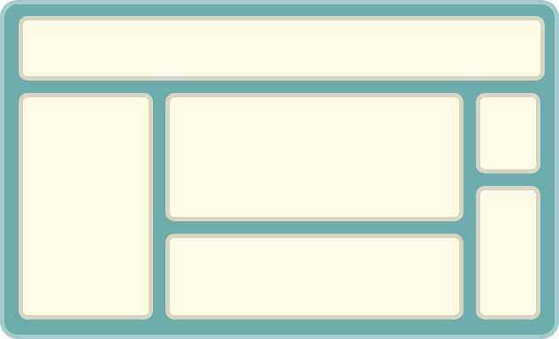
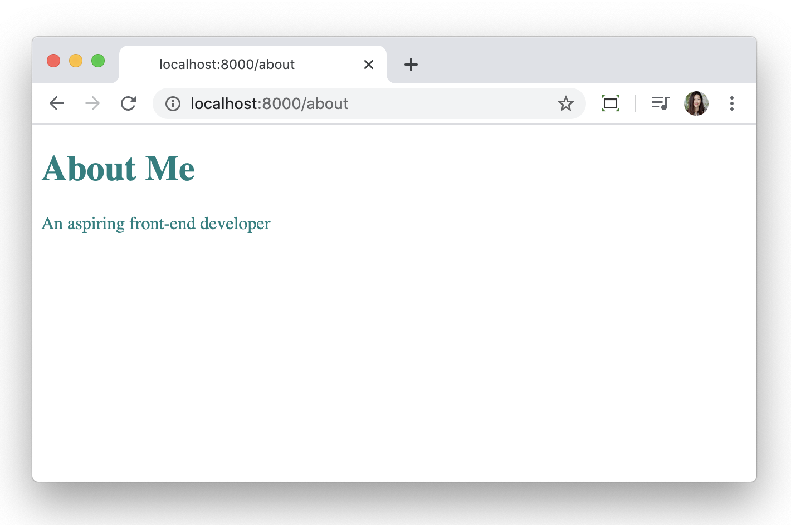
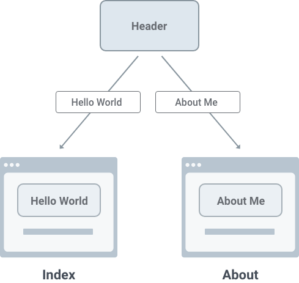

### What is a component?
React applications are built with components. Components are building blocks for your site.  A component is a piece of user interface. When building applications with React, you are essentially building independent, reusable components and composing them to build complex user interfaces.



#### A simple example
Let's say you want to create a button. In the past you were limited to a button tag with a css class.

``` HTML
<button class="primary-button">Click me</button>
```
With React, you can create a button component with styles embedded and use it throughout the site. You are not limited to browser tags anymore.

``` JSX
<PrimaryButton>Click me</PrimaryButton>
```

### Using page components in Gatsby

우선 <mark>src/pages/about.js</mark> 에 about 페이지를 만들어준다.

``` JSX
import React from "react"

const About = () => {
    return (
        <div style={{ 
            color: `teal`,
        }}>
            <h1>About Me</h1>
            <p>I'm an aspiring front-end developer.</p>
        </div>
    )
}

export default About
```



### Using sub-components
Index 페이지와 About 페이지에는 둘다 Header 섹션이 있다. Header 라는 component 를 만들어서 두 페이지에 데려올 수 있다.



#### 1. component 만들기
<mark>src/components</mark> 디렉토리 안에 header.js 파일 만들기.

``` JSX
import React from "react"

const Header = (props) => {
    return <h1>{props.headerText}</h1>
}

export default  Header
```

#### 2. 페이지에 component 불러오기

1. About.js 에 불러오기

``` JSX
import React from "react"
import Header from "../components/header"

const About = () => {
    return (
        <div style={{ color: `teal`,}}>
            <Header headerText="About Me" />
            <p>Such wow. Very React.</p>
        </div>
    )
}

export default About
```
- import 를 통해 header 를 불러온 다음
- <Header> 태그를 h1 이 들어갔던 부분에 넣어준다. 이 때 headerText property 를 통해 Header 에 들어갈 내용을 넣어준다.

2. Index.js 에도 같은 방법으로 불러온다.

#### What are props?
It's properties supplied to React components. In the About page, you passed a <mark>headerText</mark> prop with the value of <mark>"About Me"</mark>.

### Using Link component in Gatsby

#### 1. Index 페이지에서 Contact 페이지 링크해주기

``` JSX
import React from "react"
import { Link } from "gatsby"
import Header from "../components/header"

const Home = () => {
  return (
      <div style={{
	      color: `purple`,
	  }}>
        <Link to="/contact/">Contact</Link>
		<Header headerText="Hello Gatsby!" />
		<p>What a world.</p>
        
	  </div>
  );
}

export default Home
```
- {Link} 를 import 해주고
- Link to 로 링크해준다.

#### 2. Contact 페이지를 만들어 똑같이 Home 으로 링크해준다.