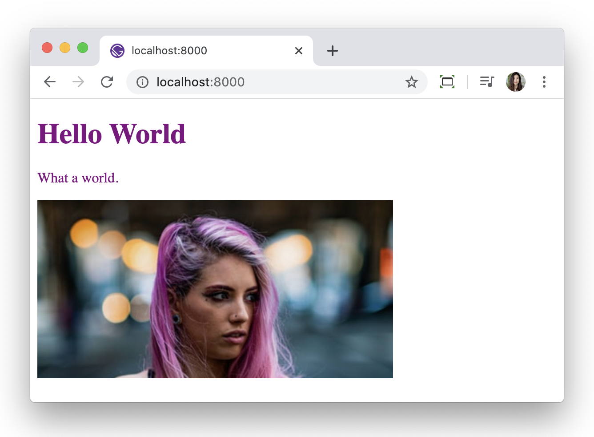

Gatsby는 React를 기반으로 만들어져있다. 새로운 블로그를 직접 커스터마이징 하며 React를 배우기로 했다. 

### Install a new blog starter
hello-world starter를 새로 설치해주고 그 블로그를 커스터마이징 해보기. 
``` console
gatsby new blog https://github.com/gatsbyjs/gatsby-starter-hello-world
```

### Start building
1. <mark>src/pages/index.js</mark>
파일을 열어보면 기본적으로 아래의 코드가 작성되어 있다.

``` javascript
import React from "react"

export default () => <div>Hello world!</div>
```
브라우저에서는 이렇게 보인다.


2. 코드를 이렇게 고쳐보면.

``` javascript
import React from "react"

const Home = () => {
  return (
      <div style={{
	      color: `purple`,
	      fontSize: `72px`,
	  }}>
	  Hello World
	  </div>
  );
}

export default Home
```


3. 코드를 한번 더 고쳐보면

``` javascript
import React from "react"

const Home = () => {
  return (
	  <div style={{
	      color: `purple`,
      }}>
		  <h1>Hello Gatsby!</h1>
		  <p>What a world.</p>
		  
	  </div>
  );
}

export default Home
```



### Wait, what just happened? HTML in Javascript?
It's called JSX. It stands for JavaScript XML. Simply meaning HTML-in-JS. 

마지막 코드를 예로 들어보면
``` javascript
import React from "react"

const Home = () => {
  return (
	  <div style={{
          color: `purple`,
	  }}>
		  <h1>Hello Gatsby!</h1>
		  <p>What a world.</p>
		  
	  </div>
  );
}

export default Home
```

- **import React from "react":** "react" module 에서 React 오브젝트를 가져온다. createElement(), appendChild() 를 일일이 쓰지 않아도 HTML 을 자바스크립트에 쓸 수 있게 해준다. (This allows us to write HTML elements in JavaScript and place them in the DOM without any createElement() and/or appendChild() methods.)

- **const Home = () => { }:** Home 이라는 variable 을 만들어준다.
  - **<div style = {{ }}>:** inline style. camelCase 쓰기.
- **export default Home:** Home을 return 해준다

다음 포스팅은 react components 에 대해서...

<small>I followed the official gatsby tutorial found [here](https://www.gatsbyjs.org/tutorial)</small>